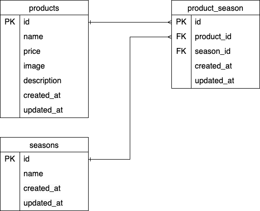

#「もぎたて」商品管理アプリ

##環境構築

```bash
cd mogitate-app
docker compose up -d
docker compose exec app composer install
cp .env.example .env
docker compose exec app php artisan key:generate
docker compose exec app php artisan migrate
docker compose exec app php artisan db:seed

##使用技術

- PHP 8.5.3
- Laravel 12.56.0
- MySQL 8.4.8
- Docker 28.3.2
- Docker Compose

##ER図



## URL

- 開発一覧：http://localhost
- 商品登録：http://localhost/items/create
- 商品詳細：http://localhost/items/{id}
- 商品編集：http://localhost/items/{id}/edit
  ※ {id} には商品IDが入ります（例：/items/1）
```
